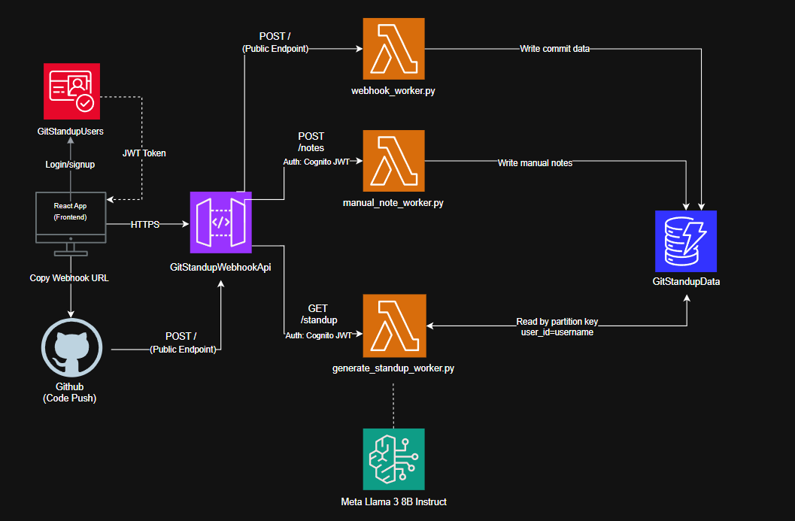

# gitStandUp 🚀

**gitStandUp** is a smart AI assistant that helps developers prepare for daily scrum meetings in seconds. It automatically tracks your code changes through GitHub webhooks and lets you type in quick manual notes about your day. 

When it's time for your standup meeting, the app uses AI to combine your code commits and notes into a clean, professional, and ready-to-read daily update.

## 🗺️ System Architecture



## 💻 Workspace & Live Demonstration

Below is the live end-to-end operational sequence showing real-time data ingestion. 

The demonstration captures a developer setting up a repository webhook, pushing a custom FastAPI Pydantic schema update, logging auxiliary category notes, and executing the orchestration engine to generate a structured daily standup summary via Meta Llama 3 on Amazon Bedrock:


[](https://youtu.be/wLtSsiu4rlc)

## 🏆 Engineering Design Wins

### 1. Webhook Deduplication (Idempotency)
* **The Problem:** GitHub webhooks can accidentally fire twice due to network retries, which would normally create duplicate commit entries in the database.
* **The Fix:** Added a native `ConditionExpression='attribute_not_exists(record_id)'` directly to the DynamoDB write loop inside the `webhook_worker` Lambda. If a duplicate commit hash hits the database, DynamoDB instantly drops it, keeping your data clean.

### 2. Smart Manual Note Hashing
* **The Problem:** If a developer clicks "Sync to Workspace" multiple times quickly, it can spam the database with duplicate rows of the exact same text log.
* **The Fix:** Replaced random timestamps with a deterministic SHA-256 hash generated from the text content (`username + category + note_text`). If they click sync on the same text again, it produces the exact same ID, causing DynamoDB to cleanly overwrite the existing item instead of duplicating it.

### 3. Edge-Level Authorization & Compute Isolation
* **The Problem:** Running custom code inside an AWS Lambda function just to validate user identity tokens on every API call introduces massive performance latency (cold starts) and wastes serverless invocation costs on unauthorized traffic.
* **The Fix:** Integrated **AWS API Gateway V2 HTTP Authorizers** directly with **AWS Cognito User Pools**. JWT access tokens are cryptographically checked at the routing layer boundary. Invalid or malicious requests are dropped instantly at the cloud network edge, completely isolating Lambda functions from processing unauthorized traffic.


### 4. Infrastructure-Level CORS Handshaking
* **The Problem:** Processing browser security preflight (`OPTIONS`) requests inside a serverless Lambda function spikes invocation costs, and adds unnecessary network latency to frontend actions.
* **The Fix:** Configured native `cors_preflight` rules directly inside the **AWS API Gateway V2 HTTP API** construct and stripped manual `OPTIONS` routes from the backend. Browser security handshakes are now fully resolved at the network routing edge, completely isolating the downstream Lambda function from handling routine cross-origin validation traffic.

### 5. GSI-Free Single-Table Cost Optimization
* **The Problem:** Creating a Global Secondary Index (GSI) on timestamp fields (`created_at`/`pushed_at`) to filter developer activity logs by specific date ranges increases storage costs and inflates active cloud billing.
* **The Fix:** Optimized data fetching by querying strictly through the primary keys (`Partition Key = user_id`). Instead of maintaining expensive database indexes, the pipeline pulls the user's complete row set and handles the 24-hour Scrum lookback window filtering in memory using native **Python `datetime` processing**, keeping database costs at an absolute minimum.

### 6. Context-Optimized LLM Token Controls
* **The Problem:** Sending raw database JSON structures directly into a Large Language Model (LLM) bloats input token counts, inflates API runtime costs, and dilutes model focus.
* **The Fix:** Implemented an enrichment filter inside `generate_standup_worker` that isolates and extracts raw text metadata arrays (`git_logs` and `manual_notes`) before building the final prompt. Additionally, applied a strict maximum ceiling parameter (`"max_gen_len": 800`) to the Meta Llama 3 payload to optimize context relevance and completely block runaway billing overhead.

## 🛠️ Tech Stack Quick Reference

| Layer | Technology | Purpose |
| :--- | :--- | :--- |
| **Frontend** | React, TypeScript, Vite | Interactive developer dashboard UI |
| **Deployment** | AWS Cloud Development Kit (CDK) | Infrastructure-as-Code (IaC) python stacks |
| **API Edge** | AWS API Gateway V2 (HTTP API) | Route handling, global CORS, edge authorization |
| **Identity** | AWS Cognito User Pools | JWT identity token validation and user access |
| **Compute** | AWS Lambda  | Decoupled serverless event workers and orchestrators |
| **Database** | Amazon DynamoDB | NoSQL single-table storage for commits and manual notes |
| **AI Intelligence** | Amazon Bedrock (Meta Llama 3) | Generative engine for automated Scrum updates |

## 🚀 Local Setup & Deployment

```bash
# 📋 PREREQUISITES: Ensure you have Node.js (v18+), Python (v3.10+), and AWS CLI configured.

# 🎛️ 1. INFRASTRUCTURE & BACKEND DEPLOYMENT (AWS CDK)

# Clone the repository and navigate to the project root
git clone https://github.com/IrisOrri/gitStandUp.git
cd gitStandUp

# Create a localized Python virtual environment container directly in the root
python -m venv .venv

# Activate the environment based on your operating system:
source .venv/bin/activate          # macOS / Linux
# .venv\Scripts\activate.bat       # Windows (CMD)
# .venv\Scripts\Activate.ps1       # Windows (PowerShell)

# Install required stack dependencies
.\.venv\Scripts\python.exe -m pip install -r requirements.txt

# Bootstrap and deploy your infrastructure resources straight to AWS
cdk bootstrap
cdk deploy

# ⚠️ CRITICAL NOTE: Once the deployment finishes, look at your terminal output!
# Copy down the generated HttpApiUrl and UserPoolClientId values.


# 💻 2. FRONTEND LOCAL CONFIGURATION (REACT + VITE)

# Move from the root directory straight into the frontend folder
cd frontend

# Install node module asset dependencies
npm install

# Initialize your local environmental configuration profile
# (Replace the placeholders below with your explicit AWS deployment outputs)
@'
VITE_AWS_API_URL=https://7fmmlyflrf.execute-api.ap-south-1.amazonaws.com/
VITE_COGNITO_CLIENT_ID=35q2ouhtjmr8ak9pvqifpafiir
'@ | Out-File -FilePath .env.local -Encoding utf8

# Spin up the local development preview server
npm run dev
